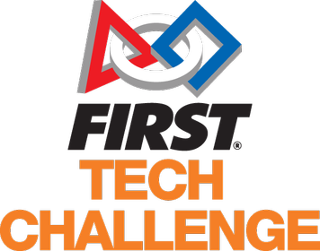

# Ce este FTC?

FTC-First Tech Challenge este o competiție sportivă specifică claselor 7-12 care presupune contruirea, proiectarea și programarea robotului. Această competiție este organizată de Asociația "Nație prin Educație". Această campanie are ca sponsor oficial BRD. Competitorii esențali în aceast nișă sunt VEX Robitics Competition și FIRST ROBOTICS COMPETITION.Acest tip de competiție sponsorizează interesul pentru creerea de roboți și participarea în competiții organizate.

 
  
  Link:https://en.wikipedia.org/wiki/FIRST_Tech_Challenge

\

Link:https://natieprineducatie.ro/vision/

## Istoric

FTC a apărut în cadrul concursului existent FIRST Robotics Competition și din platforma IFI Robovation.RadioShack și Innovation First au colaborat pentru a creea o versiune mai bună a IFI Robovation.Acesta a fost actualizat și redenumit VEX Robotics Design System.
Primul sezon al acestei competiții s-a desfășurat în 2005-2006, unde au debutat 130 de echipe. Ele au fost împărțite în 6 turnee regionale, tema având numele de FIRST Frenzy: Rising the Bar.În turneul final din aprilie 2006 din cadrul FTC Championship au participat 50 de echipe.
În vara anului 2007, numele competiției s-a schimbat din FTC VEX Challenge în First Tech Challenge.

Link:https://www.firstchesapeake.org/history/

## Structura

În fiecare sezon se organizează meciuri între echipe de robotică. De asemenea, concursul este împărțit în mai multe faze. Prima dintre ele este faza regională ,faza națională și ulterior campionatul mondial de FTC. În România meciurile se organizează la București.Fiecare echipă are doi roboți pentru a concura. Acest meciuri se desfășoară pe o suprafață dreptunghiulară. 

Link:https://www.sdftc.org/history.html

Pentru mai multe detalii despre regulament puteți să intrați pe aceste link-uri: 
Link:https://www.firstinspires.org/sites/default/files/uploads/resource_library/ftc/romanian-game-manual-part-1-remote-events.pdf
Link:https://www.firstinspires.org/sites/default/files/uploads/resource_library/ftc/romanian-game-manual-part-2-remote-events.pdf

:::tip De retinut
FTC este o competiție de robotică unde adolescenții învață să construiască roboți și să formeze o echipă.
:::

Link:https://natieprineducatie.ro/