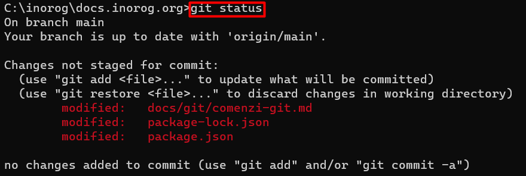
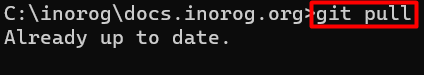
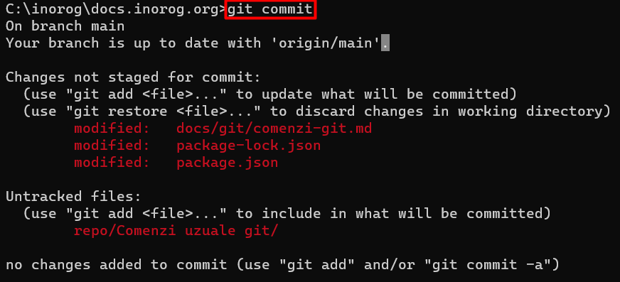
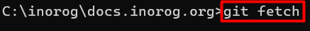
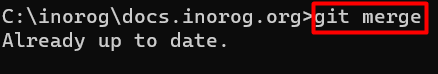
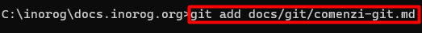

# Comenzi uzuale git

## Comanda clone. 

```bash
git clone https://github.com/inorog-org/docs.inorog.org.git
```

## Comanda status

```bash
git status
```

:::tip De retinut

:::


## Comanda pull

```bash
git pull 
```

## Comanda commit

```bash
git commit
```



## Comanda push

```bash
git push
``` 


## Comanda fetch

```bash
git fetch
```



# Comanda merge

```bash
git merge
```



## Comanda add
```bash
git add 
```

 

