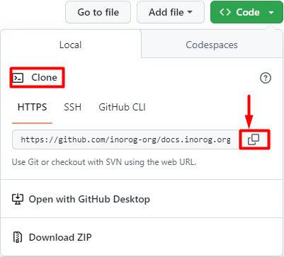
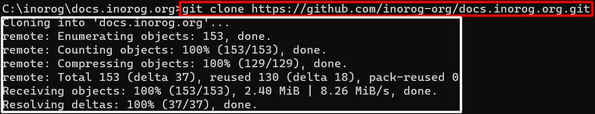

# Comenzi uzuale git

## Comanda clone. 

```bash
git clone https://github.com/inorog-org/docs.inorog.org.git
```

:::tip De retinut
 Comanda git clone este folosită pentru a transfera codul de pe repository în calculatorul tău, castfel încât să se poată face modificări programului.
:::






## Comanda status

```bash
git status
```

:::tip De retinut
Comanda status îți arată ce modificări s-au făcut în editorul tău de cod dar nu s-au salvat în git. Dacă nu apare nicio notificare înseamnă că versiunea din editorul din cod coincide cu versiunea de pe git.
:::


## Comanda pull

```bash
git pull 
```

:::tip De retinut
Comanda git pull aduce și instalează conținut dintr-o versiune trecută din repository și să actualizeze versiunea locală a acestuia.De asemenea noile modificări sunt salvate și valabile pentru toată lumea.
:::


## Comanda commit

```bash
git commit
```

:::tip De retinut
Comanda git commit menține progresul pe care l-am obținut în cadrul unui proiect și îl actualizează pe parcurs.
:::


## Comanda push

```bash
git push
``` 

:::tip De retinut
Comanda git push este folosită pentru a încărca conținutul salvat de pe versiunea locală pe versiunea unui repository cu variantă mai veche.
:::


## Comanda fetch

```bash
git fetch
```

:::tip De retinut
Comanda git fetch este folosită pentru a instala tot conținutul de pe o variantă veche a unui repository. 
:::


## Comanda merge

```bash
git merge
```

:::tip De retinut
Comanda git merge îmbină toate modificarile de pe toate branch-urile.
:::


## Comanda add

```bash
git add 
```
:::tip De retinut
Comanda git add este comanda ce actualizează modificările din editorul de cod în git.
:::

 
