# Comenzi uzuale git

## Comanda clone.

Comanda `git clone` este folosita pentru a face o copie a unui proiect stocat pe un git repository. Pentru a face aceasta clonare avem nevoie de adresa repository-ului.

Aceasta se poate gasi in sectiunea de **Code** din repository-ul dorit.

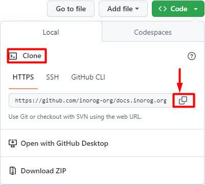

De exemplu pentru a face o copie a proiectului **docs.inorog.org** folosim comanda:

```bash
git clone https://github.com/inorog-org/docs.inorog.org.git
```
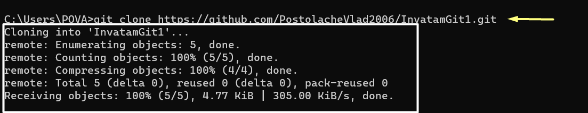

Dupa clonarea reusita a proiectului, vom avea un folder nou cu numele proiectului. Putem ajunde in acesta cu `cd nume-proiect` in exemplu nostru `cd docs.inorog.org`

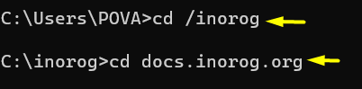

:::tip De retinut
 Comanda `git clone` este folosită doar la inceputul lucrului la proiect sau in cazurile in care vrem sa clonam proiectul in alte locatii.
:::


## Comanda status

```bash
git status
```

Comanda `git status` este folosită pentru a vedea în ce stadiu sunt fișierele noastre. Există trei șcenarii:

 **Șcenariul 1** 

 *Fișierele **nu** au fost modificate din editorul nostru de cod.*

 

 După cum se poate observa în imaginea de mai sus branch-ul nostru nu a suferit modificări. 

 
   
**Șcenariul 2** 

 *Fișierele au fost modificate din editorul nostru de cod,dar **nu** actualizate.*

 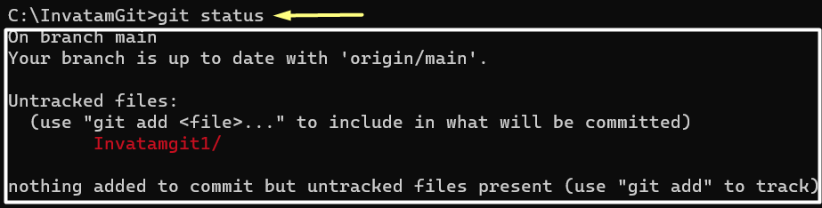

 În acest caz, se poate vedea că anumite elemente nu sunt actualizate. Folderele unde fișierele nu sunt actualizate sunt  evidențiate prin culoarea roșie cu textul *modified : ... *

**Șcenariul 3** 

*Fișierele au fost modificate din editorul nostru de cod și actualizate.*

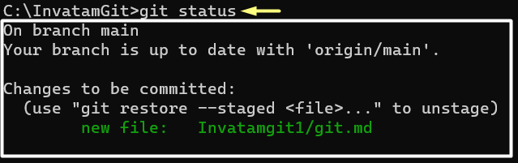

 În ultimul caz, putem observa că  modificările au fost făcute și actualizate . Folderele unde fișier sunt modificate prin culoarea verde cu textul *new file : ...*

:::tip De retinut
Comanda status îți arată ce modificări s-au făcut în editorul tău de cod dar nu s-au salvat în git. Dacă nu apare nicio notificare înseamnă că versiunea din editorul din cod coincide cu versiunea de pe git.
:::


## Comanda pull

```bash
git pull
```

Comanda `git pull` este o comandă care este formată din `git fetch`+`git merge`. Această comandă transferă  din principalul repository al proiectului în spațiul de lucru al contributorului (editorul de cod) în cazul în care versiunea sa locală nu coincide cu versiunea oficială a proiectului. Există două șcenarii

**Șcenariul 1**

*Transferul din versiunea locală a proiectului general **coincide** cu versiunea locală a contributorului*.

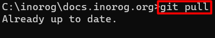

Se poate observa în această imagine că comanda `git pull` are deja modificările făcute datorită faptului că versiunile locale coincid. 


**Șcenariul 2**

*Transferul din versiunea locală a proiectului general **nu** coincide cu versiunea locală a contributorului*.

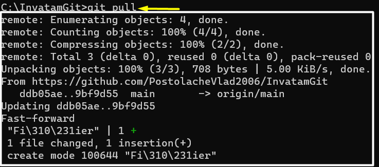

În această imagine, se poate observa că se execută această comandă și se actualizează versiunea colaboratorului.

:::tip De retinut
Comanda git pull aduce și instalează conținut dintr-o dintr-un remote repository (folderul cu proiectul oficial)   și să actualizeze versiunea locală a unui colaborator.
:::

## Comanda commit

```bash
git commit
```
Comanda `git commit` aduce modificari din laptopul colaboratorului în versiunea sa locală. Această comandă transferă toate modificările pe care le-a făcut o anumită persoană într-o baza de date locală. Recomandat este să folosim comanda care include și mesajul deoarece doar `git commit` poate aduce erori.  

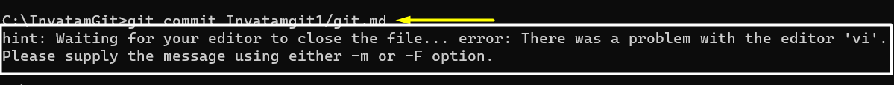

În această imagine se poate vedea eroarea în momentul ăn care introducem doar `git commit`.

```bash
git commit -m "Commit cu mesaj"
```

Comanda `git commit -m "..."` aduce modificări din laptopul colaboratorului în baza de date locală a sa afișând un mesaj .

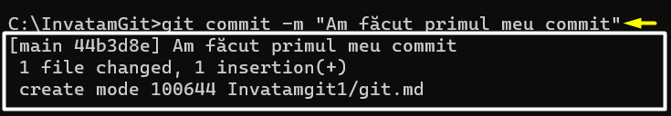

În această imagine se poate vedea că s-a făcut commit-ul cu mesaj. De asemena ne arată că fișierul a migrat în baza lui de date.

:::tip De retinut
Comanda git commit aduce modificări de pe laptopul unei persoane în baza locală de data a acesteia.
:::


## Comanda push

```bash
git push
```

Comanda `git push` este opusul comenzii `git pull`. Aceasta comandă  transferă toate modificările din repository-ul a unui contributor în repository-ul  proiectului. Practic ,persoana trimite ceea ce a lucrat , direct pe repo-ul local al proiectului. Acest le permite celorlalți utilizatori să vizualizeze modificările în acea parte a planului.
Acesta este prezent sub două șcenarii:

**Șcenariul 1**

*Comanda s-a realizat anterior și totul este actualizat*.

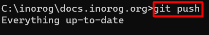

în această imagine se poate observa cum totul este trimis și actualizat prin mesajul *"Everything up-to-date"*.


**Șcenariul 2**

*Comanda **nu** s-a realizat și proiectul  **trebuie** să se actualizeze*.

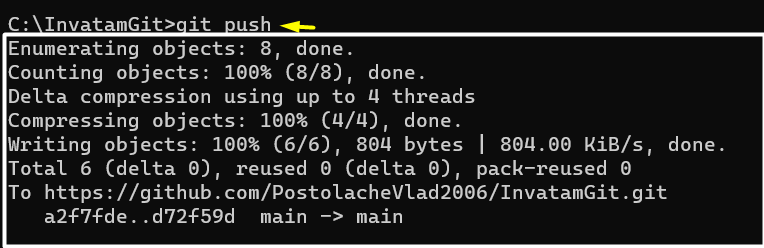

În această imagine se poat observa cum se transferă datele pentru a se efectua `git push`.

:::tip De retinut
Comanda git push este folosită pentru a încărca conținutul salvat de pe versiunea locală pe versiunea unui repository proiectului principal.
:::

## Comanda fetch

```bash
git fetch
```

Comanda `git fetch` transferă datele de pe repository-ul proiectului pe repository-ul unui colaborator. Această comandă este doar o etapă din comanda discutată anterior `git pull`. De asemenea `git fetch` poate identifica noile branch-uri formate.


:::tip De retinut
Comanda git fetch este folosită pentru a instala tot conținutul de pe o variantă veche a unui repository.
:::


## Comanda merge

```bash
git merge
```

:::tip De retinut
Comanda git merge îmbină toate modificarile de pe toate branch-urile.
:::

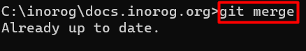

## Comanda add

```bash
git add
```
:::tip De retinut
Comanda git add este comanda ce actualizează modificările din editorul de cod în git.
:::

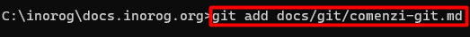
