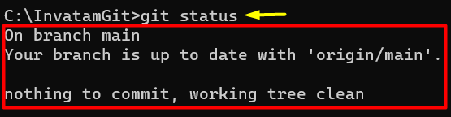
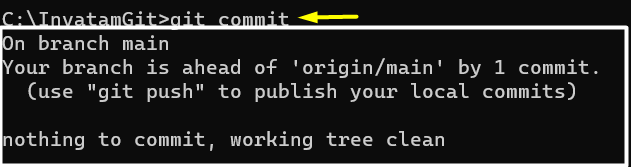
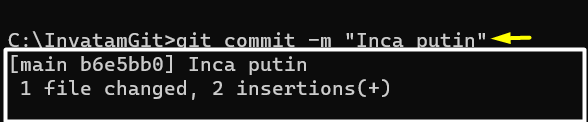
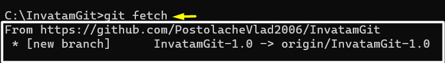
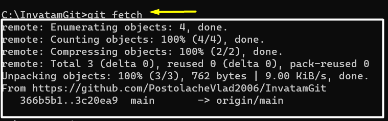
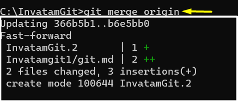
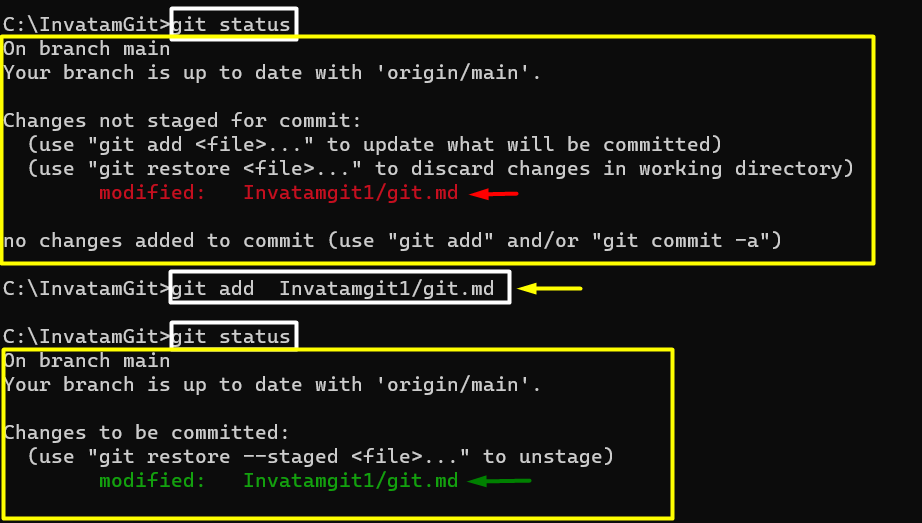

# Comenzi uzuale git

## Comanda clone.

Comanda `git clone` este folosita pentru a face o copie a unui proiect stocat pe un git repository. Pentru a face aceasta clonare avem nevoie de adresa repository-ului.

Aceasta se poate gasi in sectiunea de **Code** din repository-ul dorit.


De exemplu pentru a face o copie a proiectului **docs.inorog.org** folosim comanda:

```bash
git clone https://github.com/inorog-org/docs.inorog.org.git
```


Dupa clonarea reusita a proiectului, vom avea un folder nou cu numele proiectului. Putem ajunde in acesta cu `cd nume-proiect` in exemplu nostru `cd docs.inorog.org`


:::tip De retinut
 Comanda `git clone` este folosită doar la inceputul lucrului la proiect sau in cazurile in care vrem sa clonam proiectul in alte locatii.
:::


## Comanda status

```bash
git status
```

Comanda `git status` este folosită pentru a vedea în ce stadiu sunt fișierele noastre. Există trei șcenarii:

 **Șcenariul 1** 

 *Fișierele **nu** au fost modificate din editorul nostru de cod.*

 

 După cum se poate observa în imaginea de mai sus branch-ul nostru nu a suferit modificări. 

 
   
**Șcenariul 2** 

 *Fișierele au fost modificate din editorul nostru de cod,dar **nu** actualizate.*

 

 În acest caz, se poate vedea că anumite elemente nu sunt actualizate. Folderele unde fișierele nu sunt actualizate sunt  evidențiate prin culoarea roșie cu textul *modified : ... *

**Șcenariul 3** 

*Fișierele au fost modificate din editorul nostru de cod și actualizate.*


 În ultimul caz, putem observa că  modificările au fost făcute și actualizate . Folderele unde fișier sunt modificate prin culoarea verde cu textul *new file : ...*

:::tip De retinut
Comanda status îți arată ce modificări s-au făcut în editorul tău de cod dar nu s-au salvat în git. Dacă nu apare nicio notificare înseamnă că versiunea din editorul din cod coincide cu versiunea de pe git.
:::


## Comanda pull

```bash
git pull
```

Comanda `git pull` este o comandă care este formată din `git fetch`+`git merge`. Această comandă transferă  din principalul repository al proiectului în spațiul de lucru al contributorului (editorul de cod) în cazul în care versiunea sa locală nu coincide cu versiunea oficială a proiectului. Există două șcenarii

**Șcenariul 1**

*Transferul din versiunea locală a proiectului general **coincide** cu versiunea locală a contributorului*.


Se poate observa în această imagine că comanda `git pull` are deja modificările făcute datorită faptului că versiunile locale coincid. 


**Șcenariul 2**

*Transferul din versiunea locală a proiectului general **nu** coincide cu versiunea locală a contributorului*.


În această imagine, se poate observa că se execută această comandă și se actualizează versiunea colaboratorului.

:::tip De retinut
Comanda git pull aduce și instalează conținut dintr-o dintr-un remote repository (folderul cu proiectul oficial)   și să actualizeze versiunea locală a unui colaborator.
:::

## Comanda commit

```bash
git commit
```
Comanda `git commit` aduce modificari din laptopul colaboratorului în versiunea sa locală. Această comandă transferă toate modificările pe care le-a făcut o anumită persoană într-o baza de date locală. Recomandat este să folosim comanda care include și mesajul deoarece doar `git commit` poate aduce erori.  


În această imagine se poate vedea eroarea în momentul ăn care introducem doar `git commit`.

```bash
git commit -m "Commit cu mesaj"
```

Comanda `git commit -m "..."` aduce modificări din laptopul colaboratorului în baza de date locală a sa afișând un mesaj .


În această imagine se poate vedea că s-a făcut commit-ul cu mesaj. De asemena ne arată că fișierul a migrat în baza lui de date.

Există două șcenarii

**Șcenariul 1**

*Comanda s-a realizat anterior și modificările trebuie trimise pe remote repository prin comanda `git push` *.



În această imagine putem vedea că branch-ul nostru are deja făcut un commit. Pentru a continua să trimit modificările pe remote repository trebuie făcută comanda `git push`.

**Șcenariul 2**

*Comanda **nu** s-a realizat anterior și modificările trebuie făcute*.



În această imagine,putem observa că modificările s-au făcut. Acest lucru se poate observa prin sintagma *1 file changed*.

:::tip De retinut
Comanda git commit aduce modificări de pe laptopul unei persoane în baza locală de data a acesteia.
:::


## Comanda push

```bash
git push
```

Comanda `git push` este opusul comenzii `git pull`. Aceasta comandă  transferă toate modificările din repository-ul a unui contributor în repository-ul  proiectului. Practic ,persoana trimite ceea ce a lucrat , direct pe repo-ul local al proiectului. Acest le permite celorlalți utilizatori să vizualizeze modificările în acea parte a planului.
Acesta este prezent sub două șcenarii:

**Șcenariul 1**

*Comanda s-a realizat anterior și totul este actualizat*.


în această imagine se poate observa cum totul este trimis și actualizat prin mesajul *"Everything up-to-date"*.


**Șcenariul 2**

*Comanda **nu** s-a realizat și proiectul  **trebuie** să se actualizeze*.


În această imagine se poat observa cum se transferă datele pentru a se efectua `git push`.

:::tip De retinut
Comanda git push este folosită pentru a încărca conținutul salvat de pe versiunea locală pe versiunea unui repository proiectului principal.
:::

## Comanda fetch

```bash
git fetch
```

Comanda `git fetch` transferă datele de pe repository-ul proiectului pe repository-ul unui colaborator. Această comandă este doar o etapă din comanda discutată anterior `git pull`. De asemenea `git fetch` poate identifica noile branch-uri formate.



Există două șcenarii:

**Șcenariul 1**

*Comanda s-a realizat anterior și nu are ce să actualizeze*.


În momentul în care `git fetch` nu afișează niciun mesaj înseamnă că modificările au fost deja făcute.

**Șcenariul 2**

*Comanda `git fetch` sau alte comenzi care o includ pe aceasta (`git pull`) **nu** s-a realizat  și proiectul  **trebuie** să se actualizeze*.



În această imagine, se observă cum se tarnsferă de pe remote repository (folderul proiectului) pe cel al lucrătorului. 


:::tip De retinut
Comanda git fetch *mută* elementele de pe un **remote repository** pe un **local repository** (folderul muncitorului) .
:::


## Comanda merge

```bash
git merge
```

Comanda `git merge` transferă de pe un branch/branch-uri pe  altul fișiere care vor intra în posesia celui ce controleaza branch-ul respectiv. Acesta are două șcenarii:

**Șcenariul 1**

*Comanda s-a realizat anterior și branch-ul nu are ce să actualizeze*.


În această imagine putem vedea că branch-ul pe care suntem are o variantă finală care este deja actulizată anterior. Acest lucru se evidențiază prin mesajul *Everything is up to date*.

**Șcenariul 2**

*Comanda **nu** s-a realizat  și branch-ul/branch-urile **trebuie** să se actualizeze*.



În această imagine se poate observa că branch-urile  din poză vor fi unite într-o singură versiune pe branch-ul pe care ai făcut `git merge`.

:::tip De retinut
Comanda `git merge` îmbină toate modificarile de pe toate branch-urile și sunt salvate în un singur branch.
:::


## Comanda add

```bash
git add
```
Comanda `git add` este folosită pentru a salva fiecare modificare din comanda `git status` ,pentru a se salva în repository-ul local prin comanda `git commit`. Practic această comandă este etapa intermediară dintre `git status` și `git commit`,unde sunt salvate toate folderele modificate.



În această imagine se poate observa ce am spus mai sus, de asemenea cum se actualizează modificările și care este rolul lui `git add` în realizarea commitului.

:::tip De retinut
Comanda `git add` este comanda ce actualizează modificările din editorul de cod în baza de date locală.
:::


Acestea sunt principalele comenzi care sunt utilizate în git.


link :https://www.ntu.edu.sg/