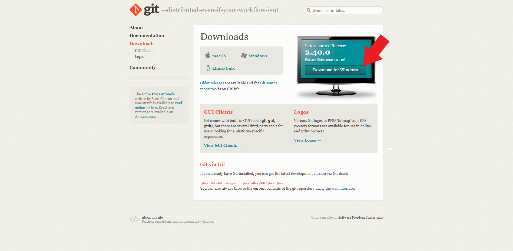
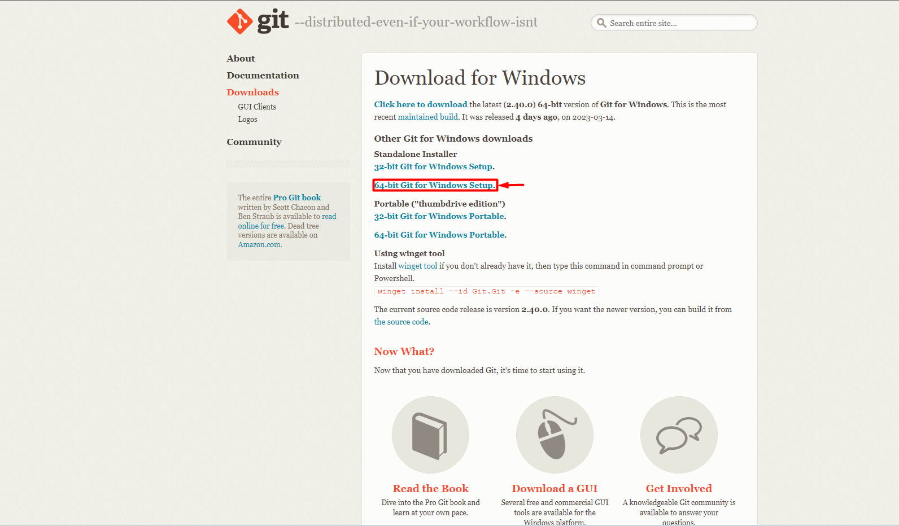
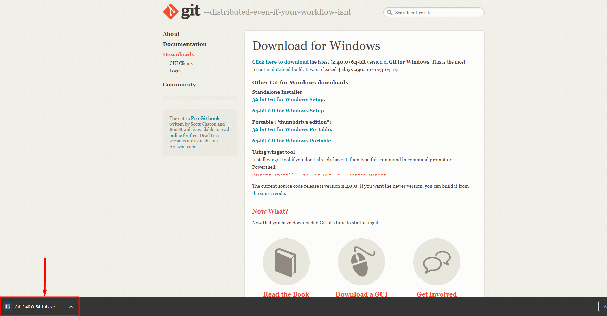
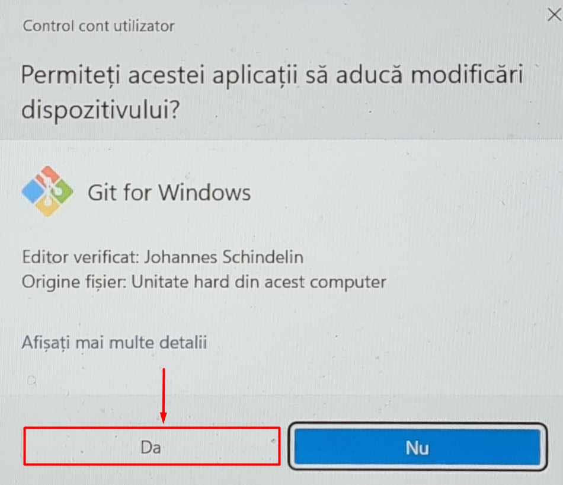
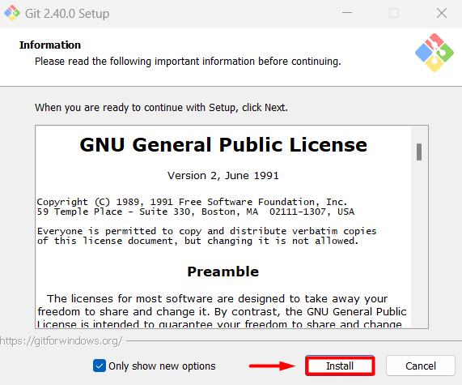
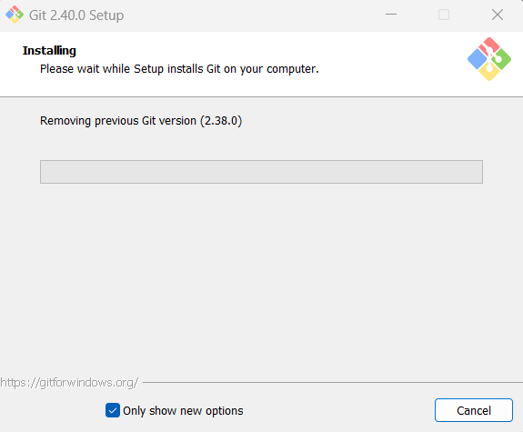
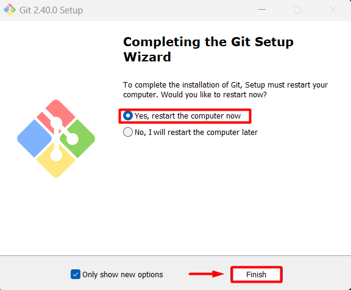
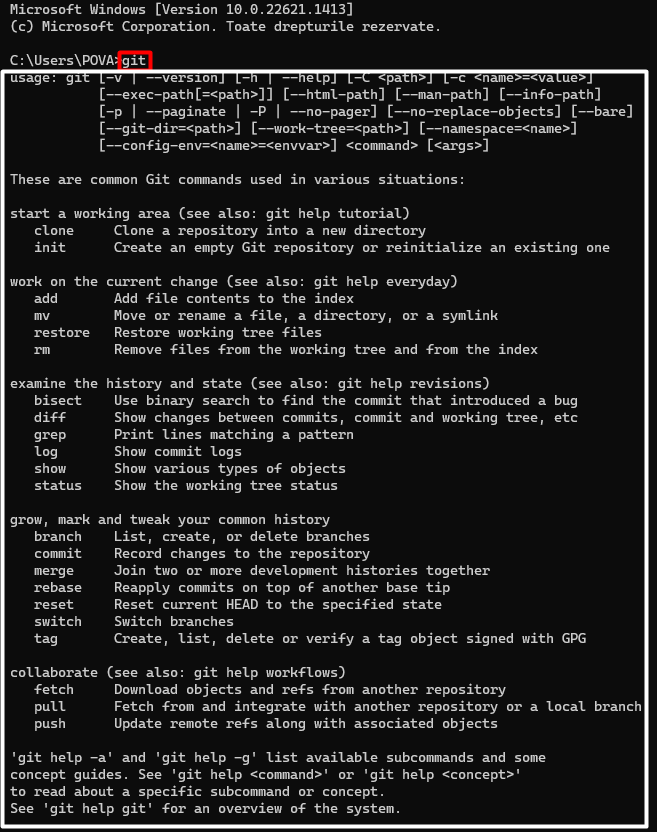

# Instalare git

Functie de sistemul de operare pe care il folositi, aveti mai multe optiuni pentru a instala git.

# Instalare pe Windows


## Pasul 1 - Open git-scm.com

În primul rând, veți intra pe link-ul de instalare a celor de la git.

[https://git-scm.com/downloads](https://git-scm.com/downloads)

Apoi apasa pe butonul de download.



### Pasul 2 - Alegere versiune

O să apară o nouă fereastră unde ai două opțiuni:
 Standalone și Portable .



 Trebuie să alegeți Standalone. Varianta recomandată este pe 64 de biti.

### Pasul 3 - Descărcare și instalare

Dupa ce programul de instalare se descarcă, se poate rula pentru instalare.

### Pasul 4 - Acceptare optiuni impreuna cu termeni și condiții

Se permite ca această aplicație să aducă modificări dispozitivului.

### Pasul 5 - Instalare finala
 

 Apăsați pe instalare.

### Pasul 6 - Mesase de instalare si butonul de final




Așteptați să se instaleze. Când se termină apăsați butonul finish.
Daca se solicita un restart al sistemului de operare așteptați să se realizeze un restart.

### Etapa de verificare

Pentru a verifica că instalarea a avut loc cu succes deschideți Linia de comandă (cmd) și scrieți " git ".



Daca aveti un mesaj similar cu cel de mai sus inseamna ca instalarea a fost realizata cu succes.

# Instalare pe Linux

## Pasul 1- Open terminal

În primul rând, deschideți linia de comanda din Linux.

## Pasul 2
 Pentru a instala git pe calculatorul tău Git trebuie să folosești o comandă. Pentru a folosi această comandă trebuie să îți instalezi Ubuntu sau Fedora.

 *Ubuntu* si *Fedora* sunt **sisteme de operare** bazate pe Linux pentru *computerele personale,servere si netbook-uri*.

 *Pentru a instala Ubuntu puteți folosi link-ul*:
https://ubuntu.com/tutorials/install-ubuntu-desktop#1-overview


** Comanda pentru instala git pe Ubuntu**

 ```bash
$ sudo apt install git-all
```

În caz că aveți erori puteți folosi comanda.

 ```bash
$ sudo apt update
```

:::tip De retinut
Comanda `$ sudo apt update` trebuie făcută înainte să instalezi Git pe Ubuntu.
:::

*Pentru a instala Fedora puteți folosi link-ul*:
https://getfedora.org/

**Comanda pentru instala git pe Fedora**

```bash
$ sudo dnf install git-all
```

