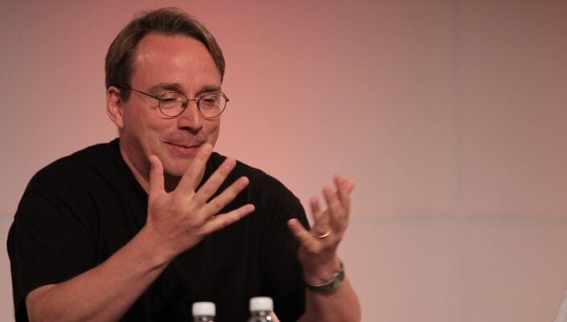

# Ce este git?

Git este un sistem distributiv de control prin care programatorii colaborează la un proiect, inserând într-un folder (repository) fișiere pe care aceștia le scriu. Folderele din cadrul acelui proiect pot fi clonate și utilizate în dispozitivul fiecărei persoane. Git este esențial în industria software deoarece permite la cât mai multe persoane să lucreze în același timp și să reunească toate versiunile fiecăruia în una singură.În cazul în care aceasta  nu vă este pe placul vostru se poate reveni la cea inițială. Obiectivele acestui algoritm este să aducă rapiditate, integritatea tuturor datelor și susținere pentru tot ce este distribuit. Toate aceste acțiuni se pot desfășura prin anumite comenzi. Există foarte multe instrucțiuni pentru ca acestea să lucreze bine și să se dezvolte un proiect amplu (comenzile uzuale se află în partea a 3). Acest program are o mare aplicabilitate în proiecte de software de mare anvergură din cadrul unei companii/firme/
 corporații. Acest program este gratuit , se instalează ușor și este facil de folosit pentru toată lumea. Odată ce înveți comenzile uzuale totul va merge bine și te vei putea adapta acestei aplicații.

 
Picture Attribution 3.0 Unported (CC BY 3.0) - https://commons.wikimedia.org/wiki/File:Git-logo.svg

## Istoric
Compania își începe activitate aprilie 2005,când dezvoltatorii nucleului Linux au renunțat la accesul BitKeeper un sistem de gestionare a controlului sursei (SCM). Acest lucru a dus la renunțare utilizării gratuite al acestui soft și de asemenea scăderea popularității acestei aplicații. Linus Torvalds(fondatorul Linux) propune să construiască un sistem nou bazat pe aceeași structura ca a lui Bitkeeper. Sistemele gratuite pe care acestea le-a folosit nu l-au satisfăcut, așa că acesta a inventat un sistem prin care a enunțat un sistem de management a sursei. Noua sa invenâie avea nevoie de 30 de secunde pentru un patch și se putea conecta cu alți întreținători în 250 de acțiuni simultan.Acesta a impus mai multe condiții. Una dintre ele se referă la durata partch-urilor la numai 3 secunde.

De asemenea această companie are trei obiective
1. Luați sistemul de versiuni concurente (CVS) ca ceva ce nu trebuie să faceți,dacă aveți îndoieli luați decizia opusă.

 CVS reprezintă un sistem de control mai vechi prin care se gestionează fișierele individual dar nu proiecte întregi.

2. Susținerea unui flux distribuit, asemănător cu BitKeeper
3. Garanții împotriva corupției

Dezvoltarea Git începe pe 3 aprilie 2005 , pe 6 aprilie a anunțat proiectul și pe 7 aprilie devine auto-hosting(Acesta poate rula numai pentru cine are Linux).

Git începe să fie cunsocut pe șcena activității software , ajungând la 6.7 patch-uri pe secundă.
Pe 26 iulie 2005 a predat întreținerea lui Junio Hamano.

*patch=actualizare software prin care se rezolvă o problemă sau îmbunătățirea funcționalității a unei aplicații sau sistem de operare.

## Ce problema rezolva

:::tip De retinut

Git conectează mai multe persoane la un loc pentru a face un proiect software împreună. Elimină problema referitoare la versiunile codului sursa. Se ajunge la un un cod software acceptat in comun de toti membrii echipei de dezvoltare.

:::

