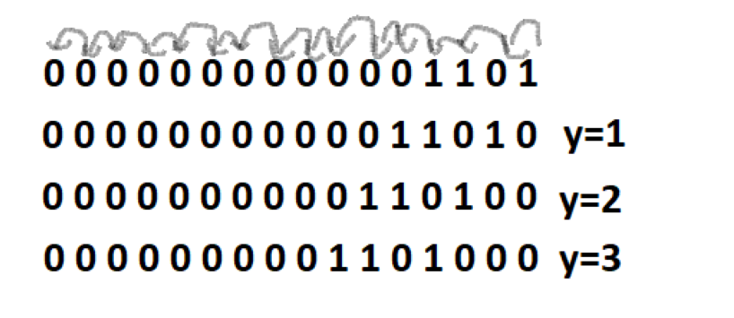
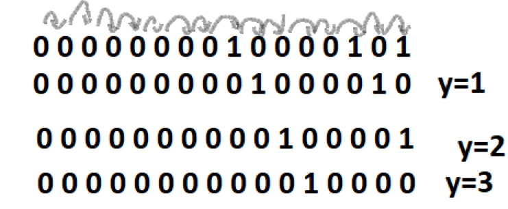
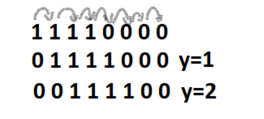

# Operatori

Operatori sunt folositi pentru a se efectua operatii pe variabile si valori.

Operatorii sunt de mai multe feluri:

+ Operatori ARITMETICI
+ Operatori de ATRIBUIRE
+ Operatori de COMPARARE
+ Operatori LOGICI
+ Operatori pe BIȚI
+ Operatori RELAȚIONARI
+ Operatori de TRANSLAȚIE
+ Operatori IF-ELSE
+ Operatorul VIRGULĂ
+ Operatorul + CONCATENARE
+ Operatori pentru CONVERSII

## Operatori ARITMETICI

| Operator    |    Nume     |             Descriere                  |        Exemplu       | 
| ----------- | ----------- | -------------------------------------- | -------------------  |
|     +       | Adunare     | Adună 2 elemente                       |         x + y        |
|     -       | Scădere     | Scade 2 elemente                       |         x - y        |
|     *       | Înmulțire   | Înmulțește 2 elemente                  |         x * y        |
|     /       | Împărțire   | Împarte 2 elemente                     |         x / y        |
|     %       | Modulo      | Împarte și află restul dintre 2 numere |         x % y        |
|    ++       | Incrementare| Crește valoarea elementului cu 1       |     x++ sau ++x      |
|    --       | Decrementare| Scade valoarea elementului cu 1        |     y-- sau --y      |

## Operatori de ATRIBUIRE

| Operator    |        Exemplu    |    Echivalent    |               Descriere                                        |
| ----------- |------------------ | ---------------- | -------------------------------------------------------------- |  
|     =       |       x = 20      |   x = 20         | I se atribuie lui x valoarea 20                               |  
|    +=       |       x += 20     |   x = x + 20     | Valoarea veche al lui x este adunata cu 20                    |  
|    -=       |       x -= 20     |   x = x - 20     | Valoarea veche al lui x este scazuta cu 20                    | 
|    *=       |       x *= 20     |   x = x * 20     | Valoarea veche al lui x este inmultita cu 20                  |  
|    /=       |       x /= 20     |   x = x / 20     | Valoarea veche al lui x este inmultita la 20                  | 
|    %=       |       x %= 20     |   x = x % 20     | Valoarea veche al lui x este impartita pentru a se afla restul| 
|    &=       |       x &= 20     |   x = x & 20     | Valoarea veche al lui x se face prin calcularea reprezentatilor binare a lui x si 20 folosind in acest caz cu operatorul & |  
|    ^=       |       x ^= 20     |   x = x ^ 20     | Scade 2 elemente                                               |
|   >>=       |       x >>= 20    |   x = x >> 20    | Valoarea veche a lui x se face prin mutarea a 20 de pozitii la dreapta a reprezentarii binare a lui x                                       |
|   <<=       |       x <<= 20    |   x = x << 20    | Valoarea veche a lui x se face prin mutarea a 20 de pozitii la stanga a reprezentarii binare a lui x | 

Inca un operator 
 | ,  x |= 20,  x = x | 10,   Valoarea veche al lui x se face prin calcularea reprezentatilor binare a lui x si 20 folosind in acest caz cu operatorul  | .


## Operatori de COMPARARE

| Operator    |    Nume           |             Descriere                    |        Exemplu       | 
| ----------- | -----------       | --------------------------------------   | -------------------  |
|     ==      | Egal cu           | Verifică dacă două valori sunt egale     |         x == y        |
|     !=      | Diferit de        | Verifică dacă două valori sunt diferite  |         x != y        |
|     >       | Mai mare decât    | Verifică dacă o valoare e mai mare strict decat cealaltă                  |         x > y        |
|     <       | Mai mic decât     | Verifică dacă o valoare e mai mică strict decat cealaltă                       |         x < y        |
|     >=      | Mai mare sau egal | Verifică dacă o valoare e mai mare sau egală decat cealaltă   |        x >= y        |
|     <=      | Mai mic sau egal  | Verifică dacă o valoare e mai mică sau egală decat cealaltă         |   x <= y       |

Exemplu pentru operatorul ==

 ```java title="Egal.java"
    public class Egal {
  public static void main(String[] args) {
   
     int x=5,y=4; //Pentru acest caz este F
     int x1=4,y1=4; ////Pentru acest caz este A

     if(x==y) System.out.println("DA");
     else System.out.println("NU");
     
     if(x1==y1) System.out.println("DA");
     else System.out.println("NU");

  }
}
```

Exemplu pentru operatorul !=

 ```java title="Diferit.java"
    public class Diferit {
  public static void main(String[] args) {
   
     int x=5,y=4; //Pentru acest caz este A
     int x1=4,y1=4; ////Pentru acest caz este F  

     if(x!=y) System.out.println("DA");
     else System.out.println("NU");
     
     if(x1!=y1) System.out.println("DA");
     else System.out.println("NU");

  }
}
```

Exemplu pentru operatorul >

 ```java title="MaiMare.java"
    public class MaiMare {
  public static void main(String[] args) {
   
     int x=5,y=4; //Pentru acest caz este A
     int x1=4,y1=4; ////Pentru acest caz este F  

     if(x>y) System.out.println("DA");
     else System.out.println("NU");
     
     if(x1>y1) System.out.println("DA");
     else System.out.println("NU");

  }
}
```

Exemplu pentru operatorul <

 ```java title="MaiMic.java"
    public class MaiMic {
  public static void main(String[] args) {
   
     int x=5,y=6; //Pentru acest caz este A
     int x1=4,y1=4; ////Pentru acest caz este F  

     if(x<y) System.out.println("DA");
     else System.out.println("NU");
     
     if(x1<y1) System.out.println("DA");
     else System.out.println("NU");

  }
}
```

Exemplu pentru operatorul >=

 ```java title="MaiMareEgal.java"
    public class MaiMareEgal {
  public static void main(String[] args) {
   
     int x=5,y=4; //Pentru acest caz este A
     int x1=4,y1=5; ////Pentru acest caz este F  

     if(x>=y) System.out.println("DA");
     else System.out.println("NU");
     
     if(x1>=y1) System.out.println("DA");
     else System.out.println("NU");

  }
}
```

 Exemplu pentru operatorul <=

  ```java title="MaiMicEgal.java"
     public class MaiMicEgal {
   public static void main(String[] args) {
    
      int x=5,y=6; //Pentru acest caz este A
      int x1=4,y1=3; ////Pentru acest caz este F  
 
      if(x<=y) System.out.println("DA");
      else System.out.println("NU");
     
      if(x1<=y1) System.out.println("DA");
      else System.out.println("NU");

   }
}
```

## Operatori LOGICI

| Operator    |    Nume           |             Descriere                                |        Exemplu       | 
| ----------- | -----------       | --------------------------------------               | -------------------  |
|     &&      | Și                | Afișează adevărat verificând dacă sunt adevărate     |   x>6 && y<7         |
|     !       | Negație           |  Neagă rezultatul și afișează adevărat verificând dacă sunt false    |   !(x>6 && y<7)          |

Încă un operator
 || (Sau)  - Afișează adevărat verificând dacă una este adevărată .Un exemplu: x>6 ||  y<7


Exemplu pentru operatorul &&

 ```java title="Si.java"
    public class Si {
  public static void main(String[] args) {
   
     int x=5,y=3;//Pentru acest caz este A
     int x1=5 , y1=0; //Pentru acest caz este F
    
    if(x>3 && y>1) System.out.println("DA");
    else if(x>3 && y<1) System.out.println("Nu");

    if(x1>3 && y1>1) System.out.println("DA");
    else if(x1>3 && y1<1) System.out.println("Nu");


  }
}
```

Exemplu pentru operatorul !

```java title="Nu.java"
    public class Nu {
  public static void main(String[] args) {
   
     int x=4,y=2; //Pentru acest caz este F
     int x1=2 , y1=0; //Pentru acest caz este A
    
     if(!(x>3)) 
    System.out.println("Da");
    else if(!(y<1)) System.out.println("Nu");

     if(!(x1>3)) 
    System.out.println("Da");
    else if(!(y1<1)) System.out.println("Nu");
    
  }
}
```

Exemplu pentru operatorul ||
```java title="Sau.java"
    public class Sau {
  public static void main(String[] args) {
   
     int x=5,y=3; //Pentru acest caz este A
     int x1=2 , y1=0; //Pentru acest caz este F
    
    if(x>3 ||  y>1) System.out.println("DA");
    else if(x>3 || y<1) System.out.println("Nu");

    if(x1>3 && y1>1) System.out.println("DA");
    else if(x1<3 && y1<1) System.out.println("Nu");
  }
}
```


## Operatori pe BIȚI

| Operator    |    Nume                |             Descriere                  |        Exemplu       | 
| ----------- | -----------            | -------------------------------------- | -------------------  |
|     &       |   Și                   |  Propoziția este adevărată (1) verificând dacă ambele valori sunt adevărate(1) , Propoziția este falsă (0) dacă una dintre valori este falsă                      |         x & y        |
|     ^       | Sau exclusiv (XOR)     |  Propoziția este  adevărată(1) verificând dacă una dintre valori este adevărată(1), de asemenea  propoziția este falsă (0) dacă ambele valori sunt adevărate(1) sau dacă ambele sunt false(0) |         x ^ y        |
|     ~       | Negație                | Neagă rezultatul și se afișează opusul tipului de bit (în loc de 0 va fi 1 și în loc de 1 va fi 0)                 |         x ~ y        |

Încă un operator:
 | (Sau)  - Propoziția este adevărată(1) verificând dacă o condiție este adevărată,în caz contrar propoziția este falsă(0) .Un exemplu: x |  y

----
#### Exemplu pentru & : ####

```java title="Si.java"
    public class Si {
  public static void main(String[] args) {
   
     int x=13,y=151; 
     
     System.out.println(x & y);//5
  }
}
```

Explicație:

Reprezentarea lui  13 este 0000000000001101
Reprezentarea lui 151 este 0000000010010111

:::tip ***Regula pentru adevarat(1) si fals(0)***
0 & 0 == 0

0 & 1 == 0

1 & 0 == 0

1 & 1 == 1
:::


Se inmultesc unele sub altele:

**0** **0** **0** **0** **0** **0** **0** **0** **0** **0** **0** **0** **1** **1** **0** **1**

**0** **0** **0** **0** **0** **0** **0** **0** **1** **0** **0** **1** **0** **1** **1** **1**

----

***0*** ***0*** ***0*** ***0*** ***0*** ***0*** ***0*** ***0*** ***0*** ***0*** ***0*** ***0*** ***0*** ***1*** ***0*** ***1***

-----
**Am calculat fiecare cu fiecare:**

*0* & *0* ==  *0*

*0* & *0* ==  *0*

*0* & *0* ==  *0*

*0* & *0* ==  *0*

*0* & *0* ==  *0*

*0* & *0* ==  *0*

*0* & *0* ==  *0*

*0* & *0* ==  *0*

*0* & *1* ==  *0*

*0* & *0* ==  *0*

*0* & *0* ==  *0*

*0* & *1* ==  *0*

*1* & *0* ==  *0*

*1* & *1* ==  *1*

*0* & *1* ==  *0*

*1* & *1* ==  *1*

S-a obtinut 0 0 0 0 0 0 0 0 0 0 0 0 0 1 0 1. Acest număr este reprezentarea binară a lui 5.

0 0 0 0 0 0 0 0 0 0 0 0 0 1 0 1 = 5

Răspuns final 5.

#### Exemplu pentru ^ : ####

```java title="SauExclusiv.java"
    public class SauExclusiv {
  public static void main(String[] args) {
   
     int x=13,y=151; 
     
     System.out.println(x & y);//154
  }
}
```

Explicație:

Reprezentarea lui  13 este 0000000000001101
Reprezentarea lui 151 este 0000000010010111

:::tip ***Regula pentru adevarat(1) si fals(0)***
0 ^ 0 == 0

0 ^ 1 == 1

1 ^ 0 == 1

1 ^ 1 == 0
:::

Se inmultesc unele sub altele:

**0** **0** **0** **0** **0** **0** **0** **0** **0** **0** **0** **0** **1** **1** **0** **1**

**0** **0** **0** **0** **0** **0** **0** **0** **1** **0** **0** **1** **0** **1** **1** **1**

----

***0*** ***0*** ***0*** ***0*** ***0*** ***0*** ***0*** ***0*** ***0*** ***0*** ***0*** ***0*** ***0*** ***1*** ***0*** ***1***

-----
**Am calculat fiecare cu fiecare:**

*0* & *0* ==  *0*

*0* & *0* ==  *0*

*0* & *0* ==  *0*

*0* & *0* ==  *0*

*0* & *0* ==  *0*

*0* & *0* ==  *0*

*0* & *0* ==  *0*

*0* & *0* ==  *0*

*0* & *1* ==  *1*

*0* & *0* ==  *0*

*0* & *0* ==  *0*

*0* & *1* ==  *1*

*1* & *0* ==  *1*

*1* & *1* ==  *0*

*0* & *1* ==  *1*

*1* & *1* ==  *0*

S-a obtinut 0 0 0 0 0 0 0 0 1 0 0 1 1 0 1 0. Acest număr suma reprezentatilor binare 2+4+16+128=154.

0 0 0 0 0 0 0 0 1 0 0 1 1 0 1 0 = 154

Răspuns final 154.

#### Exemplu pentru || : ####

```java title="Sau.java"
    public class Sau {
  public static void main(String[] args) {
   
     int x=13,y=151; 
     
     System.out.println(x || y);//159
  }
}
```

Explicație:

Reprezentarea lui  13 este 0000000000001101
Reprezentarea lui 151 este 0000000010010111

:::tip ***Regula pentru adevarat(1) si fals(0)***
0 | 0 == 0

0 | 1 == 1

1 | 0 == 1

1 | 1 == 1
:::

Se inmultesc unele sub altele:

**0** **0** **0** **0** **0** **0** **0** **0** **0** **0** **0** **0** **1** **1** **0** **1**

**0** **0** **0** **0** **0** **0** **0** **0** **1** **0** **0** **1** **0** **1** **1** **1**

----

***0*** ***0*** ***0*** ***0*** ***0*** ***0*** ***0*** ***0*** ***0*** ***0*** ***0*** ***0*** ***0*** ***1*** ***0*** ***1***

-----
**Am calculat fiecare cu fiecare:**

*0* & *0* ==  *0*

*0* & *0* ==  *0*

*0* & *0* ==  *0*

*0* & *0* ==  *0*

*0* & *0* ==  *0*

*0* & *0* ==  *0*

*0* & *0* ==  *0*

*0* & *0* ==  *0*

*0* & *1* ==  *1*

*0* & *0* ==  *0*

*0* & *0* ==  *0*

*0* & *1* ==  *1*

*1* & *0* ==  *1*

*1* & *1* ==  *1*

*0* & *1* ==  *1*

*1* & *1* ==  *1*

S-a obtinut 0 0 0 0 0 0 0 0 1 0 0 1 1 1 1 1. Acest număr este reprezentarea binara a lui 159.

0 0 0 0 0 0 0 0 1 0 0 1 1 1 1 1 = 159

Răspuns final 159.

#### Exemplu pentru ~ : ####

```java title="Nu.java"
    public class Nu {
  public static void main(String[] args) {
   
     int x=133; 
     
     System.out.println(~133);//134
  }
}
```

Explicație:

Reprezentarea lui  133 este 0000000010000101

:::tip ***Regula pentru adevarat(1) si fals(0)***
~0=1

~1=0
:::

Unde este 0 pun 1, unde este 1 pun 0

S-a obtinut 1111111101111010  Acest număr este reprezentarea binara a lui 134.

1111111101111010 = 134

Răspuns final 134.


## Operatori de TRANSLAȚIE

| Operator    |    Nume                      |             Descriere                  |        Exemplu       | 
| ----------- | -----------                  | -------------------------------------- | -------------------  |
|    <<       | shift stânga(shift left)     | Numarul este obtinut prin deplaseaza bițiilor la stânga de y ori a  reprezentării în memorie a biților                        |         x << y       |
|    >>       | shift right(shift right)     | Numarul este obtinut prin deplaseaza bițiilor la dreapta de y ori a reprezentării în memorie a biților                      |         x >> y       |
|    >>>      | shift la dreapta fără semn   |Numarul este obtinut prin deplaseaza bițiilor la dreapta de y ori a reprezentării în memorie a biților, dupa fiecare mutare la dreapta pozitiile din stanga vor fi initializate cu 0                 |         x >>> y      |

#### Exemplu pentru << : ####

```java title="ShiftRight.java"
    public class ShiftRight {
  public static void main(String[] args) {
   
     int x=13, y=3; 
     
     System.out.println(13<<3);//104
  }
}
```
Explicație

Reprezentarea binara a lui 13 este 0000000000001101. 
Y reprezinta numarul de pozitii.(3).



S-a obtinut rezultatul 0000000001101000. Aceasta este reprezentarea binara a lui 104.

#### Exemplu pentru >> : ####

```java title="ShiftRight.java"
    public class ShiftRight {
  public static void main(String[] args) {
   
     int x=133, y=3; 
     
     System.out.println(133>>3);//104
  }
}
```
Explicație

Reprezentarea binara a lui 13 este 0000000010000101. 
Y reprezinta numarul de pozitii.(3).



S-a obtinut rezultatul 0000000001101000. Aceasta este reprezentarea binara a lui 16.

#### Exemplu pentru >>> : ####

```java title="ShiftLeftFill0.java"
    public class ShiftLeftFill0 {
  public static void main(String[] args) {
   
     int x=240, y=2; 
     
     System.out.println(240>>>2);//60

  }
}
```

Explicație

Reprezentarea binara a lui 240 este 11110000 . 
Y reprezinta numarul de pozitii.(2).



S-a obtinut rezultatul 00111100 . Aceasta este reprezentarea binara a lui 60.


## Operatori IF-ELSE

Operatorul pentru if este "?" și pentru else este ":" .

 ```java title="text.java"
    public class Clase {
  public static void main(String[] args) {
   
     int x=6;
     int y=5;

     System.out.println(x>y ? "TRUE" : "FALSE");  
     /*
     Echivalent cu

     if(x>y){
       System.out.println("True"); 
     }
     else{
        System.out.println("True");
     }

     */
  }
}
```
## Operatorul VIRGULĂ

Operatorul virgula este folosit pentru declararea variabilelor 

```java title="virgula.java"
    public class Virgula {
  public static void main(String[] args) {
   
     int x=6,y=8;
  }
}
```

## Operatorul + CONCATENARE

Operatorul + este folosit pentru concatenarea sirurilor

```java title="concatenare.java"
    public class Concatenare {
  public static void main(String[] args) {
   
     String  p1="Maria";
     String  p2="afine";
     int x=10;
     System.out.println(p1 + "are" + x + " "+p2);

  }
}
```

## Operatori pentru CONVERSII

Operatorul pentru conversie "(tipul-de-data)"

```java title="concatenare.java"
    public class Concatenare {
  public static void main(String[] args) {
   
     int a = (int)'a';
     char c = (char)98;
     int i = 234;
     long l= (long)i; //conversie larga= de la un tip de data mai mic la un tip de data mai mare 
     long l2= (long)200;
     int i2=(int)l2; //conversie restransa= de la un tip de data mai mare la un tip de data mai mic 

  }
}
```


