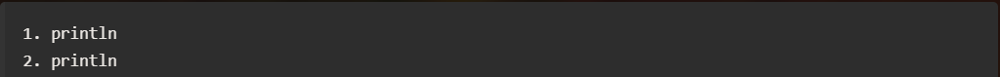

# Output

În acest capitol vom discuta despre cum putem afișa:
-un mesaj 
-un numar

## 1.Cum putem afisa un mesaj?

```java title="clase.java"
    System.out.println("Hello World");
    //sau
    System.out.print("Hello World");
    // sau
    System.out.printf("Hello World");
    //sau
    System.out.print.format("Hello World");
```
 Aceastea sunt instrucțiunile  prin care purem afisa un mesaj in Java. Acest lucru se realizează datorită metodelor **println()** , **print()** , **printf()** , **print.format()** .

## 2.Cum putem afisa un numar?

 ```java title="clase.java"
    System.out.println(3);
    //sau
    System.out.print(3);
    // sau
    System.out.printf("%s",3);
    //sau
    System.out.print.format("%s",3);
```
 Aceastea sunt instrucțiunile  prin care purem afisa un număr în Java. Acest lucru se realizează datorită metodelor **println()** , **print()** , **printf()** , **print.format()** . 

 Acum vom discuta despre ce face fiecare metoda in parte:

 ### I. Metoda: System.out.println()

 Metoda **println()** va afișa numarul/mesajul și își va muta cursorul pe următoarea linie. 

 

 ### II. Metoda: System.out.print()

  Metoda **print()** va afișa numarul/mesajul ,cursorul va rămâne pe aceeași linie.

 

 ### III. Metoda: System.out.printf()

 Afișează șirul formatat în consolă la fel ca **System.out.println()**.

 
 

 ### IV. Metoda: System.out.print.format()

 Metoda returnează un șir formatat, pe care îl puteți stoca sau utiliza așa cum doriți.

 
 

