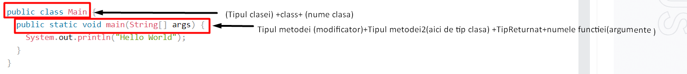

# Sintaxa

Sintaxa din java cuprinde :

**1**.**Clase**(*elementul fundamental*)

**2.**.**Metode**(*punctul de plecare*)

Vom discuta in mare despre acestea,pentru a înțelege ce se întâmplă în program. Vom discuta ulterior în detaliu ce se întâmplă în fiecare parte.



## 1.Clasa

```java title="clase.java"
public class Clase {
  public static void main(String[] args) {
    System.out.println("Hello World");
  }
}
```
**Clasele** reprezinta modalitatea prin care sunt adaugate *date noi* . *Fiecare* linie de cod/date noi ce este scrisa in Java, **TREBUIE** sa fie in interiorul unei clase. In exemplul nostru clasa se numeste - **Clase** - . Fiecare clasa se scrie cu litera **MARE**.

:::tip1 De retinut
**"Clase"** si **"clase"** au un inteles diferit in Java !!!!!
:::

:::tip2 De retinut
Numele fisierului java **TREBUIE** sa coincida cu numele clasei. 
:::

:::tip3 De retinut
Fisierul **trebuie** salvat folosind **numele_clasei** + **".java"**.
:::

## 2.Metode

```java title="metode.java"
public static void main(String[] args)
```
**Metodele** se ocupa cu *descrierea* comportamentului uricarui *obiect* . Orice cod din **main()** va fi executat. 

