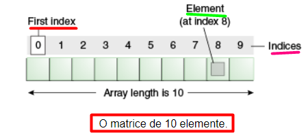
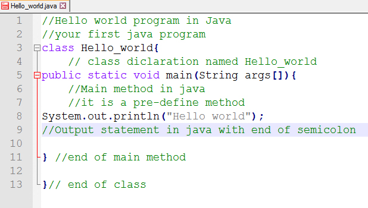
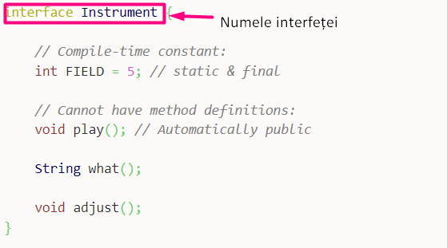

# Tipuri de date


În această lectția vom studia următorele:

+ Tipuri de date de tip primitiv
   
    + tip aritmetic

      + tip întreg 

      + tip real

    + tip caractere

    + tip logic

   

+ Tipuri de date de tip referință

  + Vectori

  + Clase

  + Interfete


## Tipuri de date de tip primitiv

Tipurile de date primitive arată mărimea și tipul de valoare a variabilei, fără să folosim nicio metodă suplimentară. Acestea sunt cele mai înâlnite.

Tipurile de date de tip primitiv se împart în 3 feluri:
  
+ Tip aritmetic

+ Tip caractere

+ Tip logic

### Tip aritmetic
 
Tipul aritmetic cuprinde
    
+ tip de date aritmetice intregi  
    
+ tip de date aritmetice reale


#### Tip aritmetic intreg

Date de tip arimetice intregi cuprind:

+ byte

+ short

+ int 

+ long

##### Byte 

***Byte*** are marimea de 1 byte si stochează numere între -128 până la 127

##### Short

***Short*** are mărimea de 2 bytes si stochează numere între -32,768 până la 32,767

##### Int

 ***Int*** are mărimea de 4 bytes si stochează numere între -2,147,483,648 până la 2,147,483,647

##### Long

***Long*** are mărimea de 8 bytes si stochează numere între -9,223,372,036,854,775,808 până la 9,223,372,036,854,775,807
     
     
#### Tip aritmetic real

+ float

+ double

##### Float

***Float*** are mărimea de 4 bytes si stochează numere fracționare cu 6 până la 7 decimale

##### Double

***Double*** are mărimea de 8 bytes si stochează numere fracționare până la 15 decimale

### Tip caractere

Tipul de caractere conține numai un tip de dată numită *char*

##### Char

***Char*** are mărimea de 2 bytes si stochează caractere , litere sau valori ale codului ASCII

### Tip logic 

Tipul de logic conține numai un tip de dată numită *boolean*

##### ***Boolean***

***Boolean*** are mărimea de 1 byte si stochează valori adevărate(true) sau false (false)

## Tipuri de date de tip referință

Tipurile de date de tip referință arată o adresă de memorie către o valoare sau o mulțime de valori care sunt reprezentate de varibila respectivă.

 Tipuri de date de tip referință

  + Vectori

  + Clase

  + Interfete

### Vectori

Un vector este un obiect container care deține un număr valori de un singur tip,lungimea acestuia fiind stabilt atucni cand acesta este declarat.




```java title="clase.java"
public class Clase {
  public static void main(String[] args) {
   String[] animals ={"Dog","Cat"}
  }
}
```
Mai multe informații sunt la lecția despre Vectori.
### Clase 

O recapitulare la ceea ce am făcut în prima lecție despre clase.

**Clasele** reprezinta modalitatea prin care sunt adaugate *date noi* . *Fiecare* linie de cod/date noi ce este scrisa in Java, **TREBUIE** sa fie in interiorul unei clase. In exemplul nostru clasa se numeste - **Clase** - . Fiecare clasa se scrie cu litera **MARE**.

:::tip1 De retinut
**"Clase"** si **"clase"** au un inteles diferit in Java !!!!!
:::

:::tip2 De retinut
Numele fisierului java **TREBUIE** sa coincida cu numele clasei. 
:::

:::tip3 De retinut
Fisierul **trebuie** salvat folosind **numele_clasei** + **".java"**.
:::

Despre clase vom discuta mai multe la lecția despre Clase.



```java title="clase.java"
public class Clase {
  public static void main(String[] args) {
    System.out.println("Aceasta este o clasa");
  }
}
```

### Interfețe

Interfețele reprezintă o clasă abstractă.



```java title="clase.java"
interface Cars {
  public void carsSound();
  public void listen();
}
```

Despre interfețe vom discuta mai multe la lecția despre Interfețe.


