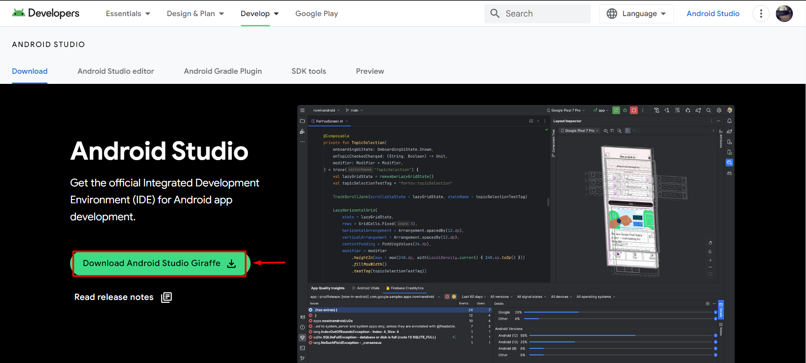

# Android Studio

## Ce este Android Studio?

Android Studio este o unealtă prin care codul pe care îl scriem este ințeles si compilat. Practic ,fără această aplicație nu putem da viață robotului. Android Studio este un editor de cod prin care noi transmitem informațiile către ControlHub. Limbajul pe care noi trebuie să îl folosim este Java.

## Instalare Android Studio

### Pas 1

