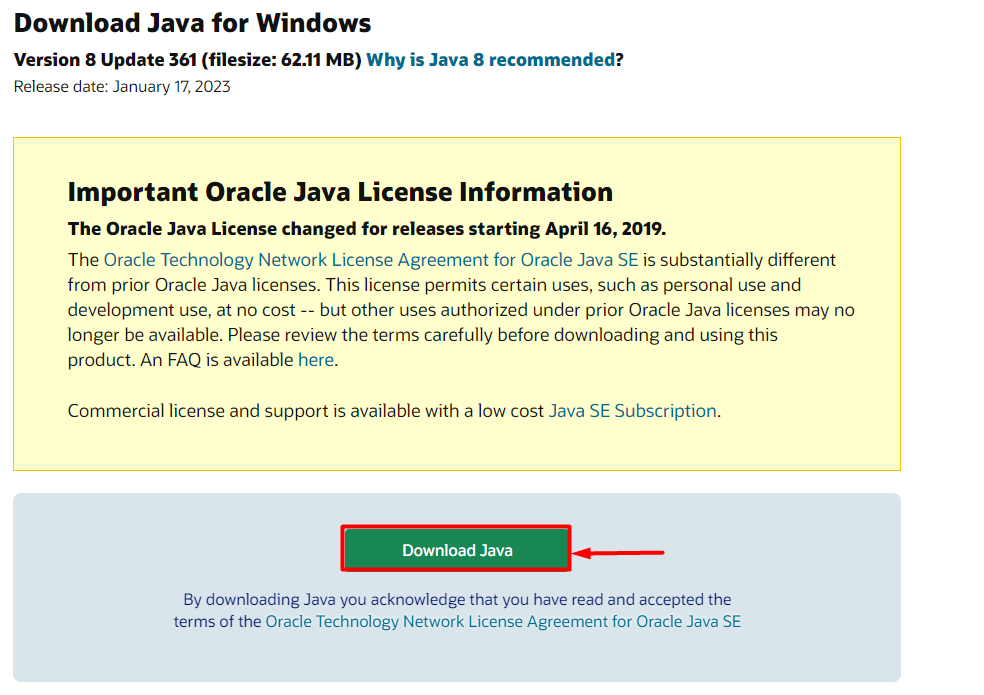
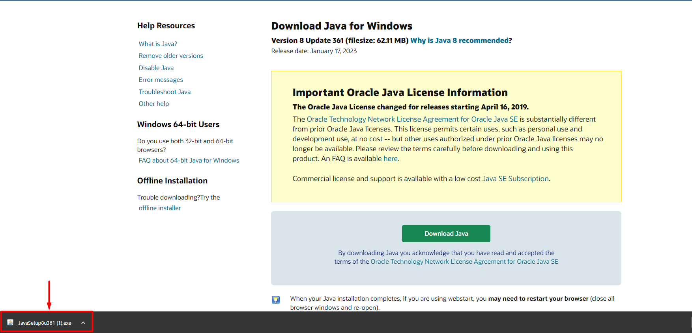
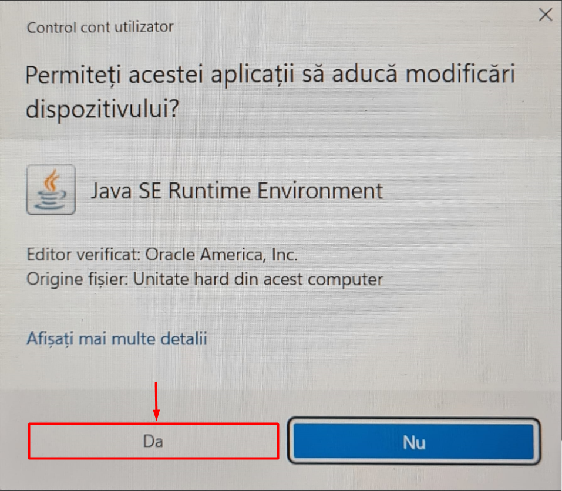
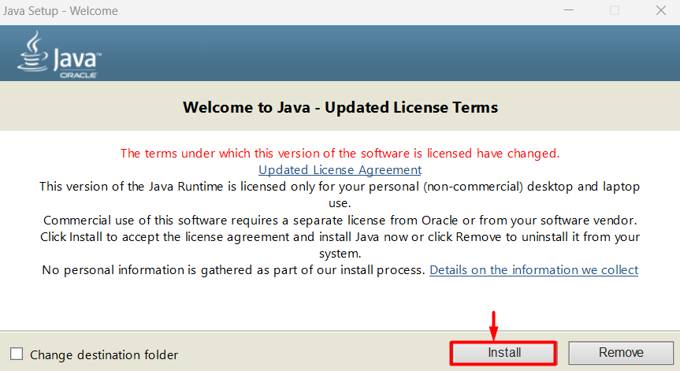
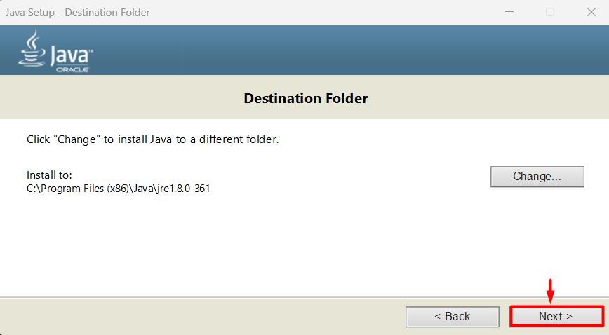
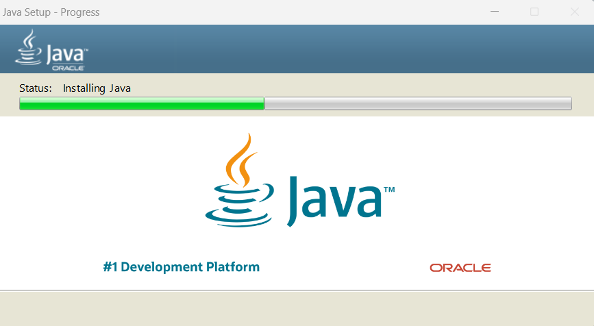
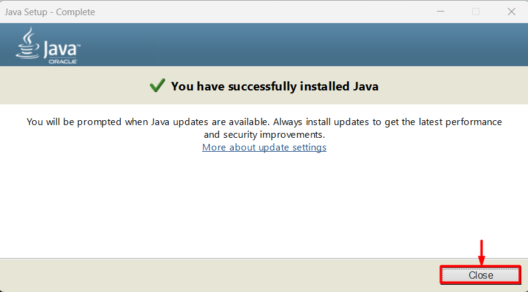
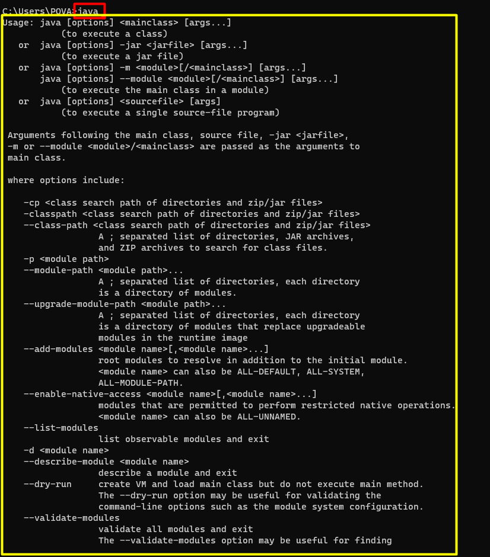
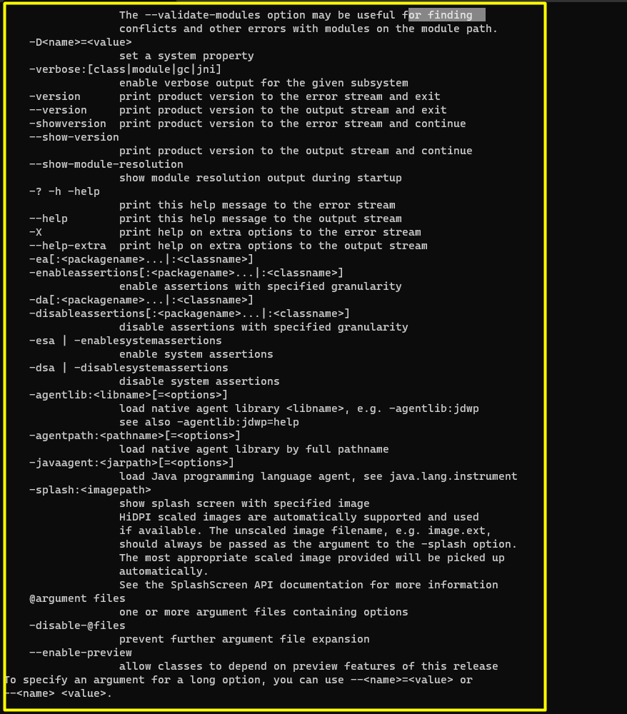

# Instalare Java

Functie de sistemul de operare pe care il folositi, aveti mai multe optiuni pentru a instala java.

# Instalare pe Windows
 

### Pasul 1 - Open Java link

Apăsați pentru link-ul de mai jos pentru a vă direcționa pe site-ul unde voi veți instala java.

[https://www.java.com/download/ie_manual.jsp](https://www.java.com/download/ie_manual.jsp)

### Pasul 2 - Click the download button

Apăsați butonul de instalare numit "Download Java".

### Pasul 3 - Descărcare și instalare

După ce programul de instalare se descarcă, se poate rula pentru instalare.

 
### Pasul 4 - Acceptare opțiuni impreuna cu termeni și condiții

Se permite ca această aplicație să aducă modificări dispozitivului.

### Pasul 5 -  Instalare finala

Apăsați pe instalare.

### Pasul 6 - Folderul cu Java

Alege folderul unde se va instala Java.

### Pasul 7 - Mesaje de instalare și butonul de final

### Etapa de verificare

Pentru a verifica că instalarea a avut loc cu succes deschideți Linia de comandă (cmd) și scrieți " java ".

Daca aveti un mesaj similar cu cel de mai sus inseamna ca instalarea a fost realizata cu succes.

# Instalare pe Linux 
