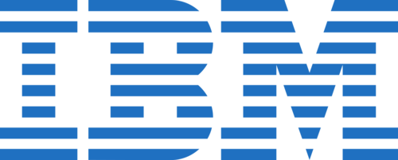
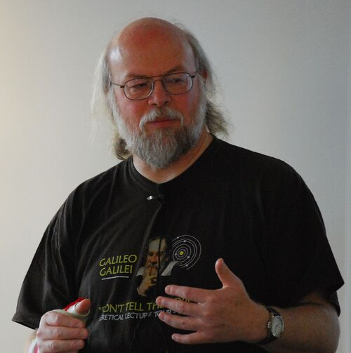

# Ce este Java?

Java este un limbaj programare orientat pe obiect. Acest limbaj de programare este dezvoltat de către James Gosling de la compania Sun Microsystems(acum filială Oracle). Majoritatea dintre aplicațiile moderne sunt scrise în limbajul Java deoarece este folosit pe mai multe sisteme și de asemenea noile evoluții tehnologice permit utilizarea sa. Acest limbaj programe oferă o platformă unică , la nivelului programtorlui și un mediu eterogen și diversificat. Cu ajutorul acestuia sunt create aplicații complexe pentru programarea aplicațiolor destinate intranet-urilor.  De asemenea este asemănător cu limbajele C și C++ , fiind un avantaj pentru persoanele care cunosc acest limbaj de programare. Pentru ca acest limbaj de programare să funcționeze pe dispozitivul dumneavoastră trebuie să vă instalați o mașină virtuală intitulată JVM ( Java Virtual Machine ). Această mașină virtuală este mediul în care codul dumneavoastră rulează în cazul în care nu are erori de compilare. Platformele unde puteți instala JVM sunt : Oracle,IBM,Bea,FSF.

%20(1)%20(1)%20(1)%20(1)%20(1)%20(1)%20(1)%20(1)%20(1).png)

## Istoric Java

James Gosling, Mike Sheridan și Patrick Naughton au inițiat acest proiect. El era destinat originar pentru ca televiziunea interactivă dar era prea avansată industria televiziunii prin cablu la acea vreme.Ei l-au denumit inițial Oak, după stejarul pe care James îl avea ca priveliște în brioul lui , ulterior a mai fost denumit Green  și Java după un tip de cafea Indoneziană. Gosling a construit acest proiect după sintaxa limbajelor de programare C/C++. Sun Microsystems a lansat pentru prima oară acest program ca Java 1.0 în 1996. Acesta avea funcționalitatea de a rula oriunde fără costuri suplimentare. De asemenea era un limbaj de programre care era sigur și de aceea browserele majore au încorporat abilitatea să ruleze Java în paginile web. De atunci Java a început să devină popular. Mai târziu compilerul Java 1.0 a fost rescris în Java de Arthur van Hoff conformându-se  la specificațiile acestui limbaj. În 1997 Sun Microsystems a abordat organismul  de standardizare ISO/IEC JTC 1 și apoi Ecma care ulterior s-a retras din acest proces.Sun a generat venituri din Java prin vinderea de licențe pentru produse specializate , un exemplu ar fi Java Enterprise System. În 1998/1999 s-a lansat Java 2 carea avuse multiple configurații pentru diferite tipuri de platforme.Pe data de 13 noiembrie 2006 Sun a lansat o mașină virtuală (JVM), pe care o va termina pe 8 mai 2007. Sun Microsystems a fost cumpărat în 2009/2010 de către Oracle. Pe 2 aprilie 2010 James Gosling a demisionat din Oracle.

Principiile fundamenatle în creerea limbajelor de progrmare Java sunt:

1. Trebuie să fie simplu, orientat pe obiect și familiar.
2. Trebuie să fie robust și securizat
3. Trebuie să fie neutru arhitectural și portabil.
4. Trebuie să fie executat cu o performanță înaltă.
5. Trebuie să fie interpretat, cuplat și dinamic.

**James Gosling**

** Mike Sheridan**

** Patrick Naughton**

## Ce problema rezolva si de ce a aparut limbajul de programare Java

Java rezolva problema referior la cablurile de televiziune și de aceea a apărut. În timp i s-a găsit o altă utilitate. În domeniul software,acesta ajută pentru a crea aplicații complexe și platforme de o mare avenrgură. Java are capacități dinamice  care nu sunt disponibile în alte limbaje de cod tradiționale.  

:::tip De retinut
Java este un limbaj de programare orientat pe obiect folosit în creere de aplicații pe toate dispozitivele.
:::

_3.png)

Link-uri: https://en.wikipedia.org/wiki/Java_(programming_language)#Documentation /
          https://ro.wikipedia.org/wiki/Oracle  /
          https://ro.wikipedia.org/wiki/IBM  /
          https://ro.wikipedia.org/wiki/Funda%C8%9Bia_pentru_Software_Liber  /
          https://en.wikipedia.org/wiki/James_Gosling  /
          https://www.bluechairgroup.com/team/mike-sheridan/  /
          https://www.linkedin.com/in/naughton  /